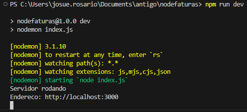

**versao do laboratório:** 1.0.0

**Data Criaçao:** 08/08/2025

# Descrição do Laboratório

Neste laboratório vamos aprender o que é node, configurar um servidor básico com rotas e instalar o nodemon

# Objetivos do Laboratório

Compreender :

- Como um servidor básico é criado em uso de frameworks
- A função e utilidade do ambiente de desenvolvimento Node
- A função e modo de instalação do nodemon
- Iniciar uma pasta como projeto node
- O que é um gerenciador de pacotes e dependências
- A Configuração básica de rotas sem framework
- O que é o entry point da aplicação

# Links para estudo e consulta

**_Pagina oficial_**

https://nodejs.org/pt

**_Introdução ao Node (da pagina Oficial)_**

https://nodejs.org/pt/learn/getting-started/introduction-to-nodejs

**_Introdução ao Node Package Manager_**

https://nodejs.org/en/learn/getting-started/an-introduction-to-the-npm-package-manager

## 1. Analisando os pré-requisitos

Para que este projeto possa funcionar corretamente o node deve estar instalado. Verifique so o node e o gerenciador de pacotes do node (npm) estão corretamente instalados rodando estes comandos :

`node --version`

`npm --version`


## 2. Iniciando o projeto

O projeto precisa ser iniciado usando o npm. O comando abaixo cria um arquivo chamado package.json com todas as configurações necessárias para iniciar o projeto

`npm init`


Este comando pode ser rodado com a clausula -y que cria o arquivo sem precisar responder as perguntas:

`npm init -y`

obs: Pode ocorre erro de permissão ao tentar rodar os comandos. Neste caso será necessário permitir a execução de scripts. Para maiores informações leia a documentação de erros conhecidos.

`Set-ExecutionPolicy -ExecutionPolicy Unrestricted -Scope CurrentUser`

## 2. Criando o servidor

Criar o server básico

nodefaturas\index.js

```javascript
// importações de bibliotecas e configurações básicas
const http = require("http");
const porta = 3000;

// Criação do servidor
const server = http.createServer((req, res) => {
  url = req.url;
  console.log("url: ", url); //rota solicitada

  //Rotas da aplicação
  res.end("inicio do projeto fatura"); // rota raiz (será excluida)
});

// Coloca o servidor no ar
server.listen(porta, () => {
  console.log("Servidor rodando");
  console.log("Endereco: http://localhost:" + porta);
});
```

Colocar o servidor no ar
`npm index`

obs: index se refere o arquivo index.js que é o entry point da aplicação. Se for utilizada outro entry point esse comando muda

- Verifique se foi criado o arquivo package.json
- Abra e observe seu formato

##Testando o servidor

| Tente acessar                     | Retorno Esperado                                                        |
| --------------------------------- | ----------------------------------------------------------------------- |
| http://localhost:3000/            | "url: /" na console e "inicio do projeto fatura no navegador            |
| http://localhost:3000/qualquerota | "url: /qualquerota" na console e "inicio do projeto fatura no navegador |


## 3. Usando IF para responder as solicitações de rotas

Exclua a rota raiz atual e no lugar adicione:

```javascript
//Rotas da aplicação
if (url === "/") {
  res.end("Rota raiz");
} else if (url === "/contato") {
  res.end("Pagina de contato");
} else if (url === "/sobre") {
  res.end("Pagina sobre");
} else {
  res.writeHead(404); //rota nao cadastrada
  res.end("Rota nao cadastrada");
}
```

- Feche o servidor com CTRL + C e abra novamente com `node index`
- Teste as rotas e observe os resultados de acordo com a rota solicitada.
- Não se esqueça de testar uma rota que não está cadastrada.

## 4. Configurando o Nodemon

Toda vez que alguma alteração é feita no código é preciso reiniciar o servidor. Para evitar este trabalho podemos instalar o nodemon que fará o reinicio automático.

Feche o servidor e instale o Nodemon

`npm install nodemon --save-dev`

obs: observe como o arquivo packag.json muda.

A cláusula `--save-dev` serve para instalar a dependencia apenas no ambiente de desenvolvimento já que não é necessário nodemon no ambiente de produção ( pagina rodando para acesso do usuário final)


Vamos configuar package.json para rodar o script dev. Acrescente a linha de script na parte de scripts do arquivo. Não se esqueça da virgula.

```json
  "scripts": {
    "test": "echo \"Error: no test specified\" && exit 1",
    "dev": "nodemon index.js"
  },
```

Feche o servidor e rode a aplicação usando o comando abaixo. A partir de agora enquanto o servidor estiver rodando não será mais necessário reiniciar quando houver alterações no código.

`npm run dev `


