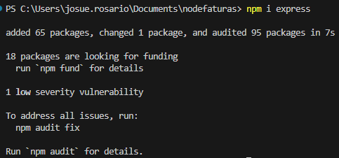
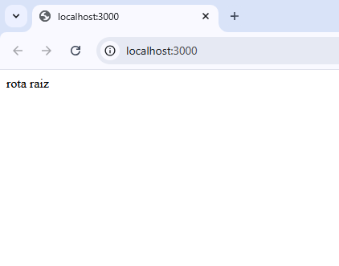
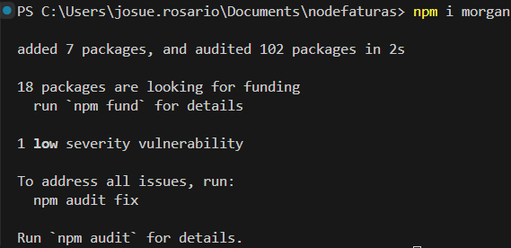
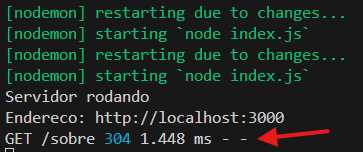

**versao do laboratório:** 1.0.0

**Data Criaçao:** 08/08/2025

# Descrição do Laboratório

Neste laboratório vamos configurar o framework Express para lidar melhor com as rotas e o Morgan para mostrar mais informações dos requests que estão sendo enviados ao servidor.

# Objetivos do Laboratório

Compreender :

- O que é um framework e qual sua utilidade
- A configurar o framework Express
- A Configurar o Morgan
- A Configurar rotas usando o Express

# Links para estudo e consulta

Introdução Express/Node

https://developer.mozilla.org/pt-BR/docs/Learn_web_development/Extensions/Server-side/Express_Nodejs/Introduction

Pagina oficial do Express

https://expressjs.com/

Morgan - Gerando log das requisições HTTP

https://devpleno.com/morgan

Repositório do Morgan

https://github.com/expressjs/morgan

**Qual a utilidade do Nodemon ?**

Reiniciar o projeto quando algum arquivo for alterado. Ou seja, evita que tenhamos que matar o servidor com CTRL + C e reiniciar novamente toda vez que alguma alteração é feita

**Qual a utilidade do Morgan ?**

O morgan é capaz de gerar dados melhores sobre as requisições que o servidor recebe. Podemos configurar por exemplo para mostrar quais dados estão sendo enviados pelo cliente em um formulário de cadastro por exemplo.

# 1. Configurando e Instalando o Express

Adicione as linhas abaixo para configurar o Express

./index.js

```javascript
const http = require("http");
const porta = 3000;
const express = require("express"); // Linha adicionada
const app = express(); // Linha adicionada
```

A variável server não existe mais portanto o listen deve ser executado a partir de app. No código abaixo modifique de Server para app.

```javascript
app.listen(porta, () => {
  // Server foi trocado para app
  console.log("Servidor rodando");
  console.log("Endereco: http://localhost:" + porta);
});
```

instale o express como dependência

```
npm i express
```



# 2. Configurando a rota raiz usando Express

Remova a função CreateServer inteira e adicione as linhas

./index.js

```javascript
app.get("/", (req, res) => {
  res.send("rota raiz");
});
```

O código completo fica deste jeito

./index.js

```javascript
const http = require("http");
const porta = 3000;
const express = require("express");
const app = express();

// rotas da aplicação
app.get("/", (req, res) => {
  res.send("rota raiz");
});

app.listen(porta, () => {
  console.log("Servidor rodando");
  console.log("Endereco: http://localhost:" + porta);
});
```

Caso ainda não tenha roda o projeto, execute o comando
`npm run dev`

Nas linha de comando verifique se o servidor está no ar e abra a aplicação no navegador.



# 3. Configurando as rotas sobre e contato

Adicione as seguintes rotas

```javascript
app.get("/contato", (req, res) => {
  res.send("rota contato");
});

app.get("/sobre", (req, res) => {
  res.send("rota sobre");
});
```

O express sempre vai procurar as rotas de cima para baixo e devolver a primeira que encontra

# 4. Configurando um rota de erro

Para que o express devolva um erro quando a rota não for encontrada acrescente a rota :

```javascript
app.use((req, res) => {
  res.status(404).send("Página não encontrada!");
});
```

obs: a função Use() capturar qualquer requisição e devolver um erro com status 404. Esta rota deve ser colocada depois de todas as rotas.

# 5. Testando a aplicação

Use a tabela abaixo para efetuar testes manuais na aplicação

| Tente acessar                 | Retorno Esperado       |
| ----------------------------- | ---------------------- |
| http://localhost:3000/        | rota raiz              |
| http://localhost:3000/contato | rota contato           |
| http://localhost:3000/sobre   | rota sobre             |
| http://localhost:3000/xyz     | Página não encontrada! |

obs: cuidado se você mudou a porta precisa alterar o valor 3000

# 6. Configurando o morgan

O Morgan é um middleware que vai nos dar melhores informações, na console, sobre as requisições que estão sendo enviadas. Vamos estudar melhor este conceito de middleware mais para frente no curso.

Por hora, acrescente o require do morgan e a linha de configuração no inicio do arquivo

```javascript
const http = require("http");
const porta = 3000;
const express = require("express"); //linha acrescentada
const morgan = require("morgan");
const app = express();

// configurações iniciais
app.use(morgan("dev"));
```

Instale o Morgan como Dependencia

```
npm i morgan
```



Verifique se o servidor esta no ar, solicite uma rota qualquer e observe a saida na console do servidor



Agora temos informações do método HTTP e otempo que levou a request, com possibilidades de configurar outras informações no futuro

# Alterações Executadas

| Data       | Responsável   | Descrição           |
| ---------- | ------------- | ------------------- |
| 28/08/2025 | Josué Rosario | Criação do Tutorial |
