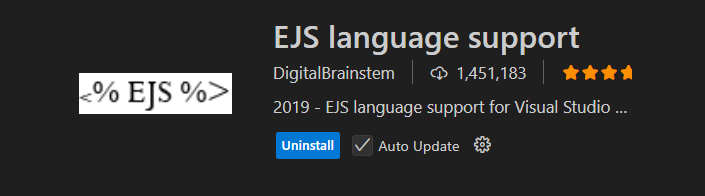
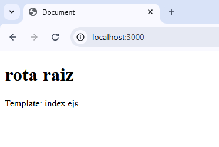

**versao do laboratório:** 1.0.0

**Data Criaçao:** 08/08/2025

# Descrição do Laboratório

Neste laboratório vamos compreender o que é uma Views e configurar EJS o motor de templates do Express.

# Objetivos do Laboratório

Compreender :

- O Modelo MVC
- A configurar o EJS
- O que é e como criar uma template

# Links para estudo e consulta

**_Pagina oficial_**

https://ejs.co/

**_Usando ESJ com Express_**

https://github.com/mde/ejs/wiki/Using-EJS-with-Express

obs: Tutorial Não usa o npm

**_Tutorial de EJS_**

https://pedrompinto.medium.com/tutorial-node-js-como-usar-o-engine-ejs-12bcc688ebab

# 1. Instalando Configurando o EJS

Rode o comando para instalar o EJS

`npm i ejs`

Adicione as duas linhas de configuração do EJS

```javascript
// configurações iniciais
app.use(morgan("dev"));
app.set("views", "./views"); //adicionado
app.set("view engine", "ejs"); //adicionado
```

Crie a pasta .\views

# 2. Criando a template index

Crie a view abaixo

.\views\index.ejs

```html
<!DOCTYPE html>
<html lang="pt-BR">
  <head>
    <meta charset="UTF-8" />
    <meta name="viewport" content="width=device-width, initial-scale=1.0" />
    <title>Document</title>
  </head>
  <body>
    <h1><%= mensagem %></h1>
    <p>Template: index.ejs</p>
  </body>
</html>
```

Instalar a extensão ejs language support



<<<<<<< HEAD
Modifique a rota raiz para chamar usar a view index
=======
Altere a rota raiz para chamar a template index
>>>>>>> 46ee48b (Tut 3 implementado)

```javascript
app.get("/", (req, res) => {
  //res.send('rota raiz');
  res.render("index", { mensagem: "rota raiz" });
});
```

Coloque o sevidor no ar e teste a rota raiz para ver se tudo funcionou.



# 3. Configure a view para as outras rotas

```javascript
app.get("/contato", (req, res) => {
  //res.send('rota contato');
  res.render("index", { mensagem: "rota contato" });
});

app.get("/sobre", (req, res) => {
  //res.send('rota sobre');
  res.render("index", { mensagem: "rota sobre" });
});
```

# 4. Criando uma template específica para o erro 404

Criar a template

./views/erro404.ejs

```html
<!DOCTYPE html>
<html lang="pt-BR">
  <head>
    <meta charset="UTF-8" />
    <meta name="viewport" content="width=device-width, initial-scale=1.0" />
    <title>Rota Não encontrada</title>
    <!-- Essa não é uma boa pratica de programaçao -->
    <!-- Será corrigida futuramente -->
    <style>
      h1,
      p {
        font-size: 50px;
      }
    </style>
  </head>
  <body>
    <h1>Opss algo deu errado</h1>
    <p>Não encontramos essa rota</p>
  </body>
</html>
```

alterar a rota para renderizar a template

```javascript
// Rota de erro
app.use((req, res) => {
  res.status(404).render("erro404");
});
```

# 5. Criando um partial

A template index e a template erro404 possui códigos em comum. A parte do head é comum as duas templates. Para evitar duplicidade código podemos criar um partial que são partes de código que podem ser reutilizadas entre templates

crie a pasta /views/partials

copie o head de erro 404 para o arquivo head.ejs

./views/partial/head.ejs

```html
<head>
  <meta charset="UTF-8" />
  <meta name="viewport" content="width=device-width, initial-scale=1.0" />
  <title>Rota Não encontrada</title>
  <!-- Essa não é uma boa pratica de programaçao -->
  <!-- Será corrigida futuramente -->
  <style>
    h1,
    p {
      font-size: 50px;
    }
  </style>
</head>
```

Onde vai o head nas duas templates modifique para incluir o head.ejs

erro404.ejs fica assim

```html
<!DOCTYPE html>
<html lang="pt-BR">
  <%- include('./partials/head') %>
  <body>
    <h1>Opss algo deu errado</h1>
    <p>Não encontramos essa rota</p>
  </body>
</html>
```

index.ejs fica assim

```html
<!DOCTYPE html>
<html lang="pt-BR">
  <%- include('./partials/head') %>
  <body>
    <h1><%= mensagem %></h1>
    <p>Template: index.ejs</p>
  </body>
</html>
```

obs: A aplicação vai ficar diferente porque index.ejs não usa um style mas erro404 usa. Vamos corrigir isto futuramente

# Alterações Executadas

| Data       | Responsável   | Descrição           |
| ---------- | ------------- | ------------------- |
| 28/08/2025 | Josué Rosario | Criação do Tutorial |
