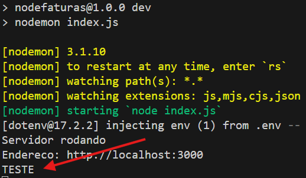

**versao do laboratório:** 1.0.0

**Data Criaçao:** 04/09/2025

# Descrição do Laboratório

Algumas informações não deveriam ser inseridas diretamente dentro do código ou serem configurações gerais da aplicação como a por exemplo a porta em que a aplicação está rodando, ou informações sensíveis como senha de banco.

Neste lab vamos configurar o dotenv, uma biblioteca que permitirá criar um arquivo específico para estas informações.

# Objetivos do Laboratório

Compreender :

- biblioteca dotenv

# Links para estudo e consulta

**_link oficial do dotenv_**

https://www.npmjs.com/package/dotenv


# 1. Configurando a biblioteca dotenv

Instalar o dotenv
`npm install dotenv`

Exemplo de saída

```
npm install dotenv

added 1 package, and audited 182 packages in 5s

40 packages are looking for funding
  run `npm fund` for details

found 0 vulnerabilities
```

criar o arquivo .env  vazio na pasta raiz do projeto

.env
```
VARIAVEL=TESTE
```

obs: este arquivo será usada para guardar as variáveis de ambiente do projeto. Entre elas a string de conexão do mongodb

Configure as variáveis de ambiente no projeto

./index.js

```javascript
const morgan = require('morgan');
const app = express();

//variáveis de ambiente
require('dotenv').config() //esta linha foi adicionada

```


Modifique o código para subir o servidor para testar

./index.js

```javascript
app.listen(porta, () => {
    console.log('Servidor rodando');
    console.log('Endereco: http://localhost:'+porta);
    console.log(process.env.variavel) || 3000 //esta linha foi adicionada
});
```
obs.: `|| 3000` define uma porta padrão caso a variável PORTA não esteja definida em .env

Rode a aplicação
`npm run dev`

O valor da variável aparece na console

exemplo de saída



# 2. Configurando a porta

 Vamos configurar a porta como variável de ambiente.
 
 Altere o arquivo .env conter apenas a variável porta

.env
```
PORTA=3000
```

Mova a linha que define a porta para o setor de configurações

 index.js


 ```javascript
 const http = require('http');
// const porta = 3000 //excluir
const express = require('express');
const morgan = require('morgan');
const app = express();

//variáveis de ambiente
require('dotenv').config();

// configurações iniciais
app.use(morgan('dev'));
app.set('views', './views');
app.set('view engine', 'ejs');
app.use(express.static('./public'));
const porta = Number(process.env.PORTA) //adicionar
```

Retire a linha de teste do listen()

```javascript
app.listen(porta, () => {
    console.log('Servidor rodando');
    console.log('Endereco: http://localhost:'+porta);
    // console.log(process.env.variavel); //excluir esta linha
});
```

O arquivo .env por padrão deve ser ignorado ao subir o projeto para o github. Faça uma copia do arquivo e renomeie para .env.exemplo e exclua o valor da porta, o arquivo fica assim

.env.exemplo
```
PORTA=
```

Quando um clone do projeto for realizado este arquivo deverá ser renomeado novamente para .env e configurado de acordo com o ambiente em que estiver sendo executado.


# Alterações Executadas

| Data       | Responsável   | Descrição           |
| ---------- | ------------- | ------------------- |
| 04/09/2025 | Josué Rosario | Criação do Tutorial |
