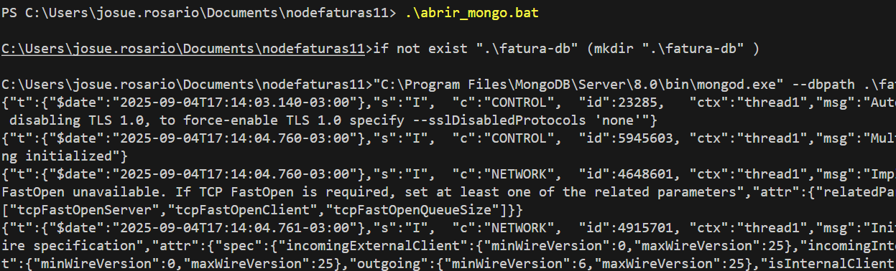

**versao do laboratório:** 1.0.0

**Data Criaçao:** 04/09/2025

# Descrição do Laboratório

Neste laboratório vamos configurar um ODM (Object-Document Mapper) para trabalhar com o MongoDB.

# Objetivos do Laboratório

Compreender :

- Banco de dados não relacionais (NoSQL)
- Configuração de banco de Dados em projetos node/express
- O que é ODM
- Relação do ODM com um ORM
- Mongoose
- Drivers de banco de dados


# Links para estudo e consulta

**_Pagina oficial do Mongoose_**

https://mongoosejs.com/


**_Getting Started do Mongoose_**

https://mongoosejs.com/docs/index.html

**_Pagina Oficial do MongoDB_**

https://www.mongodb.com/

# 1. Instando dependencias

Driver do mongodb

`npm install mongodb`

Mongoose

`npm install mongoose` 

# 1. Criando e configurando o arquivo de conexão com o banco

Vamos conectar ao banco usando um arquivo padrão de conexão. Esta abordagem é muito util porque futuramente se for preciso alterar o banco basta criar um novo arquivo de conexão

Crie o arquivo de conexão com o banco

.\libs\dbConnect.js
```javascript
const mongoose = require('mongoose');
const MONGODB_URI = process.env.MONGODB_URI;
if (!MONGODB_URI) throw new Error('MONGODB_URI esta faltando');
mongoose.connect(MONGODB_URI, {
    dbName: process.env.DBNAME,
    bufferCommands: false,
});
console.log('Conectado ao MongoDB');
```

Configure o arquivo .env 

.env
```
PORTA=3000
MONGODB_URI=mongodb://localhost/fatura-db
DBNAME=fatura-db
```

criar a pasta onde vão ficar os arquivos do banco

./fatura-db

Adicionar o import do arquivo de configuração

```javascript
const http = require('http');
const express = require('express');
const morgan = require('morgan');
const app = express();

//variáveis de ambiente
require('dotenv').config();

//Conexao com o banco
require('./libs/dbConnect');
```

# 2. Criando um bat para criar banco automaticamente

O arquivo abaixo cria a pasta fatura-db, se não existir, e o banco automaticamente.

abrir_mongo.bat
```
if not exist ".\fatura-db" (
    mkdir ".\fatura-db"
)

"C:\Program Files\MongoDB\Server\8.0\bin\mongod.exe" --dbpath .\fatura-db
```

obs: Veja se o arquivo mongod.exe está no caminho informado, dentro de program files (arquivos de programa). Se não estive altere o caminho dentro do arquivo bat.

# 3. Colocar a pasta fatura-db no .gitignore

A pasta do banco não deve subir para o  github portanto será necessário adicionar como exclusão no final do arquivo .gitignore

.gitignore

```
# Arquivos de banco
fatura-db/
```

# 4. Colocando o MongoDB no ar

Rode o arquivo abrir_mongo.bat

Se estiver em uma linha de comando powershell rode com o comando `.\abrir_mongo.bat`

Se estiver em uma linha de comando cmd ou terminal rode com o comando `abrir_mongo.bat`

Se tudo estiver ok o servidor do mongoDB vai subir e o banco será criado dentro de fatura-db. 

Exemplo



CTRL + C fecha o processo do banco e do arquivo bat. Neste caso será necessário pressionar a letra S 


# Alterações Executadas

| Data       | Responsável   | Descrição           |
| ---------- | ------------- | ------------------- |
| 04/08/2025 | Josué Rosario | Criação do Tutorial |
