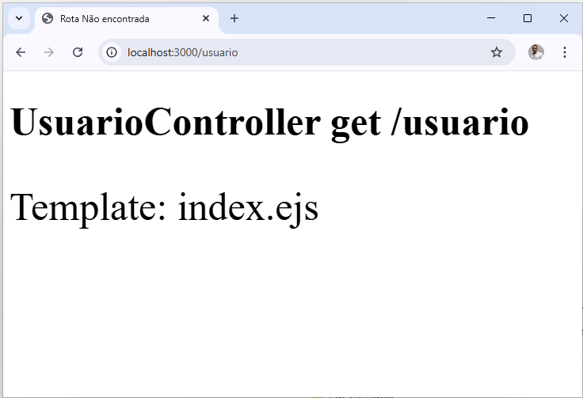
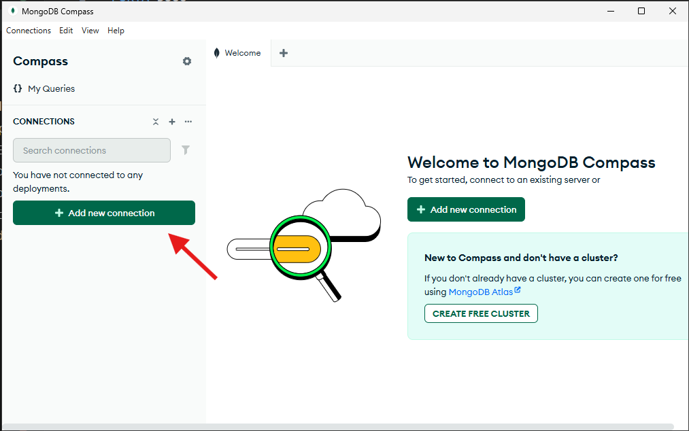
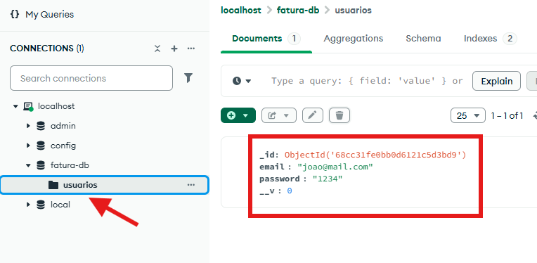

**versao do laboratório:** 1.0.0

**Data Criaçao:** 11/09/2025

# Descrição do Laboratório

Neste laboratório vamos colocar o projeto no padrão MVC e criar o objeto usuário

# Objetivos do Laboratório

Compreender :

- padrão MVC
- Schema
- Configuração de schema e model usando mongoose
- Configuração de arquivos de Rotas
- Funções do mongoose: Create, findOne,findOneAndUpdate findOneAndDelete,
- Interceptação de erro com Try().Catch()
- Tratamento de promessas (promisses)

# Links para estudo e consulta

**_Pagina oficial do Mongoose_**

https://mongoosejs.com/

**_Schemas_**

https://mongoosejs.com/docs/api/schema.html

**_Models_**

https://mongoosejs.com/docs/api/model.html

**_API do mongoose para queries_**

https://mongoosejs.com/docs/api/query.html

# 1. Configurar a Rota usuários

Adicionar o routes

```javascript
const http = require("http");
const express = require("express");
const router = express.Router(); // linha adicionada
const morgan = require("morgan");
const app = express();
```

criar o arquivo de rotas de usuário

routes\usuario.routes.js

```javascript
const express = require("express");
const router = express.Router();

router.get("/", (req, res) => {
  res.render("index", { mensagem: "get /usuario" });
});

router.get("/criar", (req, res) => {
  res.render("index", { mensagem: "get /usuario/criar" });
});
router.get("/deletar", (req, res) => {
  res.render("index", { mensagem: "get /usuario/deletar" });
});

module.exports = router;
```

importar o arquivo dentro do entry point

index.js

```javascript
const http = require("http");
const express = require("express");
const router = express.Router();
const morgan = require("morgan");
const app = express();

//importação de rotas
const usuarioRoutes = require("./routes/usuario.route"); //linha adicionada
```

configurar a rota /usuario para chamar o arquivo de rotas

```javascript
//rotas de usuario
app.use("/usuario", usuarioRoutes); // linha adicionada

// Rota de erro
app.use((req, res) => {
  res.status(404).render("erro404");
});
```

obs: Observe que o use da rotas foi colocado antes da rota de erro

Testar as rotas

- /usuario
- /usuario/criar
- /usuario/deletar

# 2. Criando o Controller

Criar a base de todas a funções e exportar

.\controllers\usuario.controller.js

```javascript
const obterUsuario = (req, res) => {};
const criarUsuario = (req, res) => {};
const alterarUsuario = (req, res) => {};
const deletarUsuario = (req, res) => {};

//Permite usar as funções fora deste modulo
module.exports = {
  obterUsuario,
  criarUsuario,
  alterarUsuario,
  deletarUsuario,
};
```

Importar o UsuarioController dentro do arquivo de rotas.Adicione a linha do require no arquivo de rotas

routes\usuario.routes.js

```javascript
const express = require("express");
const usuarioController = require("../controllers/usuarioController.js");
const router = express.Router();
```

# 3. Realocando a função de callback da rota /usuario

O arquivo de rotas não deve mais responder as requisições porque isto é a função do controller. Por isso vamos realocar as funções de callback de cada rota para o controller, começando pela rota /usuario

Comente a rota raiz do usuário e modifique conforme indicado

routes\usuario.routes.js

```javascript
router.get("/", usuarioController.obterUsuario);

// router.get('/', (req, res) => {
//     res.render('index',{mensagem:'get /usuario'})
// });
```

Mova a linha de render para o controller. Neste ponto modifique também a mensagem que está sendo enviada para a view

```javascript
const obterUsuario = (req, res) => {
  res.render("index", { mensagem: "UsuarioController get /usuario" });
};
```

Solicite a rota /usuario e observe o resultado



# 4. Realocando a outras rotas

O mesmo que foi feito na rota /usuario deverá ser feito nas outras rotas. O arquivo de rotas fica desta maneira:

routes\usuario.routes.js

```javascript
const express = require("express");
const usuarioController = require("../controllers/UsuarioController.js");
const router = express.Router();

router.get("/", usuarioController.obterUsuario);
router.get("/criar", usuarioController.criarUsuario);
router.get("/alterar", usuarioController.alterarUsuario);
router.get("/deletar", usuarioController.deletarUsuario);

module.exports = router;
```

O controller fica desta maneira:

```javascript
const obterUsuario = (req, res) => {
  res.render("index", { mensagem: "UsuarioController get /usuario" });
};
const criarUsuario = (req, res) => {
  res.render("index", { mensagem: "UsuarioController get /usuario/criar" });
};
const alterarUsuario = (req, res) => {
  res.render("index", { mensagem: "UsuarioController get /usuario/alterar" });
};
const deletarUsuario = (req, res) => {
  res.render("index", { mensagem: "UsuarioController get /usuario/deletar" });
};

//Permite usar as funções fora deste modulo
module.exports = {
  obterUsuario,
  criarUsuario,
  alterarUsuario,
  deletarUsuario,
};
```

obs: Observe que a rota alterar foi adicionada neste ponto

Faça o teste solicitando as rotas abaixo observe se o resultado é semelhante ao ultimo teste:

- /usuario/
- /usuario/criar
- /usuario/alterar
- /usuario/deletar

# 4. Configurando o Model

Adicione o modelo do usuário

models\usuario.model.js

```javascript
const { Schema, model } = require("mongoose");

const UsuarioSchema = new Schema({
  email: {
    type: String,
    required: true,
    unique: true,
  },
  password: {
    type: String,
    required: true,
  },
});

const Usuario = model("Usuario", UsuarioSchema);
```

Dentro do controller faça o require do model na primeira linha

controllers\UsuarioController.js

```javascript
const Usuario = require("../models/UsuarioModel.js");
```

# 5. Configurar a rota /usuario/criar

Esta rota será responsavel por criar usuários dentro do mongoDB.

Modifique a função criarUsuário como a seguir:

```javascript
const criarUsuario = async (req, res) => {
  try {
    //cria um usuário usando mongoose
    await Usuario.create({
      email: "joao@mail.com",
      password: "1234",
    }).then((usuarioCriado) => {
      res.render("usuario", {
        mensagem: "Usuario Criado",
        usuario: usuarioCriado,
      });
    });
  } catch {
    res.render("index", { mensagem: "Ocorreu um erro" });
  }
};
```

| Codigo         | Breve Comentário                                                                                         |
| -------------- | -------------------------------------------------------------------------------------------------------- |
| Usuario.create | Cria um usuário e retorna uma promisse que é tratada com then()                                          |
| try{}catch{}   | Intercepta qualquer erro que ocorre no trecho do codigo dentro do try() e trata o erro dentro de catch{} |

Porque preciso do try{}.Catch{} aqui ?

Sem o try{}catch{} ao tentar criar um novo usuário que já existe o sistema emite erro.

Suba a instância do banco de dados

`.\abrir_mongo.bat `

rode a rota /usuario/criar.


Neste ponto os dados devem ter sido inseridos porém precisamos confimar usando o compass GUI.

Link baixar:

https://www.mongodb.com/try/download/compass

Para verificar se os dados foram inseridos no banco:

1. Abra o compass
2. Clique em add new connection



3. Adicione a string de conexão do banco que está no arquivo .env

Exemplo:

`mongodb://localhost/fatura-db`

4. Clique em save&connect
5. Na arvore a esquerda selecione fatura-db e usuarios



# 6. Configurar a rota /usuario/

Esta rota pesquisa e retorna um usuário criado.

controllers\UsuarioController.js

```javascript
const obterUsuario = (req, res) => {
  const usuario = Usuario.findOne({ email: "joao@mail.com" });
  usuario
    .then((usuario) => {
      if (usuario) {
        res.render("Usuario", {
          mensagem: "usuario recuperado",
          usuario: usuario,
        });
      } else {
        res.render("Usuario", { mensagem: "usuario nao encontrado", usuario: null });
      }
    })
    .catch((erro) => {
      res.render("Usuario", { mensagem: "Erro desconhecido", , usuario: null });
    });
};
```

obs: A função findOne retorna uma promisse que está sendo tratada por then.

No pesquisar a view usuário é renderizada mas ela ainda não existe. Crie a view abaixo

views\usuario.ejs

```javascript
<!DOCTYPE html>
<html lang="pt-BR">
<%- include('./partials/head') %>
<body>
    <div class="m-4">
        <h1 class="text-emerald-500"><%= mensagem %></h1>
        <% if (usuario) { %>
            <p><%= usuario.email %></p>
            <p><%= usuario.password %></p>
        <% } %>
    </div>
</body>
</html>
```

# 6. Configurar a rota /usuario/deletar

# Alterações Executadas

| Data       | Responsável   | Descrição                           |
| ---------- | ------------- | ----------------------------------- |
| 18/09/2025 | Josué Rosario | Criação do Tutorial                 |
| 26/09/2025 | Josué Rosario | Adicionado view usuario no tutorial |
