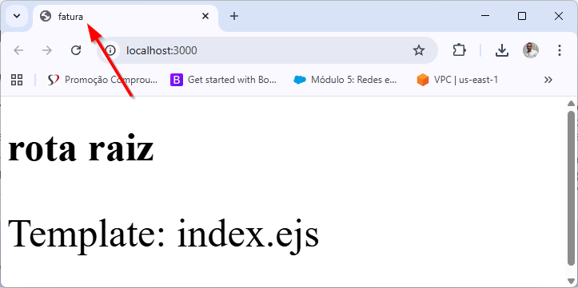
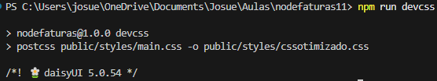
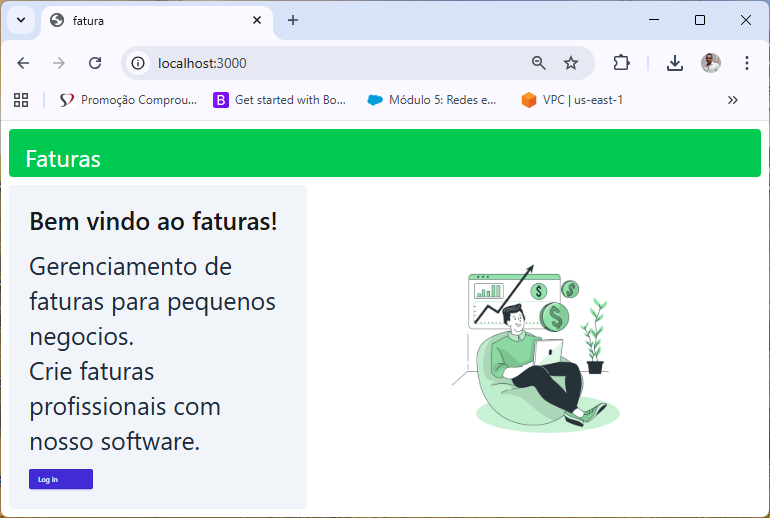

**versao do laboratório:** 1.0.0

**Data Criaçao:** 05/10/2025

# Descrição do Laboratório

Neste tutorial vamos eliminar os testes que fizemos e passar a trabalhar nas views finais da aplicação. Desde a ultima atualização que foi feita a maneira de configurar o postCSS passou por alterações e vamos refletir estas alterações no código para as novas versões do postcss. Além disso vamos corrigir o problema do título da aplicação.

# Objetivos do Laboratório

Compreender :

- Conceito de refatoração

# 1. Corrigindo o problema de envio de titulo

Para qualquer rota chamada o titulo da pagina permanece como "Rota Não encontrada" porque este é o valor harcoded dentro de views\partials\head.ejs. Vamos corrigir este problema primeiro.

Troque "Rota não encontrada" pela variável titulo.

views\partials\head.ejs

```html
<head>
  <meta charset="UTF-8" />
  <meta name="viewport" content="width=device-width, initial-scale=1.0" />
  <title><%= titulo %></title>
  <!-- Essa não é uma boa pratica de programaçao -->
  <!-- Será corrigida futuramente -->
  <link rel="stylesheet" href="/styles/cssotimizado.css" />
</head>
```

A partir deste ponto qualquer rota chama pela aplicação `router.get()` precisará enviar a variável titulo. Como vamos refatorar nossas rotas e aplicações vamos alterar apenas da rota raiz para testar nossa alteração, e a rota de erro

index.js

```javascript
// rotas da aplicação
app.get("/", (req, res) => {
  //res.send('rota raiz');
  res.render("index", { mensagem: "rota raiz", titulo: "fatura" }); //linha alterada
});
```

```javascript
// Rota de erro
app.use((req, res) => {
  res.status(404).render("erro404", { titulo: "rota não encontrada" }); //linha alterada
});
```

obs: chamadas a outra rotas, além da rota raiz, neste ponto vão emitir erro.



# 2. refatorado a rota index e corrigindo configuração do postcss

Altere o código do index.ejs para a nova view

```html
<!DOCTYPE html>
<html lang="en">
  <%- include('./partials/head') %>
  <body>
    <main class="flex min-h-screen flex-col p-4">
      <div
        class="flex h-24 shrink-0 items-end rounded-lg bg-green-500 p-4 text-5xl"
      >
        <div class="flex flex-row items-center text-white">
          <i class="fa-solid fa-coins pr-4"></i>
          Faturas
        </div>
      </div>
      <div class="mt-4 flex grow flex-col gap-4 md:flex-row">
        <div
          class="flex flex-col justify-center gap-6 rounded-lg bg-slate-100 px-6 py-10 md:w-2/5 md:px-10"
        >
          <h1 class="text-3xl font-medium">Bem vindo ao faturas!</h1>
          <p class="text-xl text-gray-800">
            Gerenciamento de faturas para pequenos negocios.
            <br />
            Crie faturas profissionais com nosso software.
          </p>
          <a class="btn btn-primary w-32" href="/login">
            Log in
            <i class="ml-auto fa-solid fa-arrow-right"></i>
          </a>
        </div>
        <div
          class="flex items-center justify-center p-6 md:w-3/5 md:px-20 md:py-8"
        >
          
        </div>
      </div>
    </main>
  </body>
</html>
```

Se a aplicação for atualizada neste momento, você verá a nova view sem nenhuma estilização. É necessário rodar o comando `npm run devcss` novamente para o novo css adicionado seja 'compilado' e adicionado ao aquivo cssotimizado.css que está dentro da pasta public. Vamos rodar este comando mas antes é preciso atualizar as configurações do devcss

renomeie o arquivo tailwind.css que está dentro de public\styles\ para tailwind.css.old pois não vamos mais utiliza-lo

modifique o arquivo main.css conforme indicado

```css
@import "tailwindcss";
@plugin "daisyui";
@import "./custom.css";
```

obs: A primeira linha do import do tailwind foi alterada e a linha do plugin do daisyui também foi alterada.

Retire a opção -w do comando devcss do arquivo package.json

```json
  "scripts": {
    "test": "echo \"Error: no test specified\" && exit 1",
    "dev": "nodemon index.js",
    "devcss": "postcss public/styles/main.css -o public/styles/cssotimizado.css"
  },
```

obs: Esta clausula serve apenar para manter o devcss no ar para recompilar o CSS quando adicionamos novas views porém como esta atividade não é muito frequente vamos retirar a opção.

Rode novamente o comando

`npm run devcss`

exemplo de saida


Copie a imagem homem-comp.png que está dentro de docs\Arquivos_base\ para dentro de public\img

rode a aplicação, a rota raiz deve ter alterações


# 3. Refatorações necessárias

Neste ponto algumas refatorações de código são necessárias. Fizemos até o momento bastante coisa mas a maioria dela apenas para testar conceitos como:

- Configuração de log com morgan
- Configuração de variáveis de ambiente
- Configurações de rota
- Configuração do mongoDB
- Operações CRUD usando mogoose

A partir deste momento a maioria das necessidades da aplicação estão configuradas. Vamos focar agora nas funcionalidades das aplicação. Portanto algumas partes do código que serviram apenas para testes devem ser retiradas.

Mesmo que inativo, vamos manter partes do código apenas para questões de consultas futuras.

- Em index.js remova as rotas sobre e contato
- Renomeie o arquivo usuario.routes.js para usuario.routes.js.old
- Crie um novo arquivo usuario.routes.js

routes\usuario.routes.js

```javascript
const express = require("express");
const usuarioController = require("../controllers/UsuarioController.js");
const router = express.Router();

// Novas rotas de usuario

module.exports = router;
```

- Renomeie usuarioController.js para usuarioController.js.old
- Crie um novo usuarioController.js

controllers\usuarioController.js

```javascript
const Usuario = require("../models/UsuarioModel.js");

module.exports = {};
```

# Alterações Executadas

| Data       | Responsável   | Descrição           |
| ---------- | ------------- | ------------------- |
| 05/10/2025 | Josué Rosario | Criação do Tutorial |
